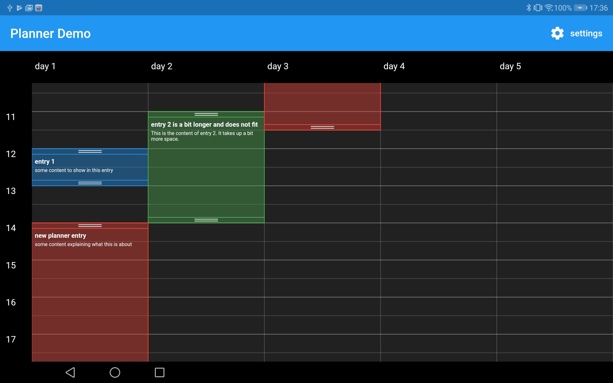

# Planner

A calendar event scheduler interface. The widget is preferably used (almost) fullscreen. It displays events in a table. 



## Features
- Scrollable hours handle.
- Scrollable days handle.
- Zoomable event schedule.
- Events can be moved after a long press.
- Event start and ending can be changed by moving the handles (also with long press).
- Callbacks are provided for tapping on an event and on the planner.
- Also has a callback for when an events has been moved.

## Getting Started

Add the package to pubspec.yaml:

```dart
planner: ^0.0.1
```

Import planner:

```dart
import 'package:planner/planner.dart';
```

## Events
Planner expects a list with events of type `PlannerEntry`. The events are not based on `DateTime` to provide maximum flexibility. A `PlannerEntry` constructor accepts these arguments:
- day (`int`) _required_
- hour (`int`) _required_
- minutes (`int`) _defaults to 0_
- duration (`int`) _in minutes, defaults to 60_
- title (`String`)
- content (`String`)
- color: (`Color`) _required, this is the background color_
   

```dart
var entries = List<PlannerEntry>();
entries.add(PlannerEntry(
    day: 0,
    hour: 12,
    minutes: 15,
    duration: 120, // in minutes
    title: 'entry 1',
    content: 'some content to show in this entry',
    color: Colors.blue
));
```

## Planner
The planner can be added as a child object. It needs a few arguments:

- labels: (`List<String>`) _required_ The day labels. This also determines how many dates are shown.
- minHour: (`int`) _required_ the earliest hour to show. Events earlier than this are not shown.
- maxHour: (`int`) _required_ the latest hour to show.
- entries: (`List<PlannerEntry>`) _required_
- blockHeight: (`int`) _defaults to 40_ the height of a date field, if no zooming is active
- blockWidth: (`int`) _defaults to 200_ the width of a date field, if no zooming is active
- onEntryChanged: `Function(PlannerEntry)` The callback called when an entry was changed. (Moved, start or duration has changed by dragging the event.)
- onEntryDoubleTap: `Function(PlannerEntry)` The callback called when a double tap on the event happened.
- onPlannerDoubleTap: `Function(int day, int hour, int minute)` The callback called when a double tap in the planner happened, without an event underneath. 

```dart
Widget build(BuildContext context) {
    return Scaffold(
      appBar: AppBar(
        title: Text('Planner Demo'),
      ),
      body: Planner(
        labels: ['day 1', 'day 2', 'day 3', 'day 4', 'day 5'],
        minHour: 8,
        maxHour: 20,
        entries: entries,
        onEntryDoubleTap: onEntryDoubleTap,
        onPlannerDoubleTap: onPlannerDoubleTap,
        onEntryChanged: onEntryChanged,
      ),
    );
  }
```
